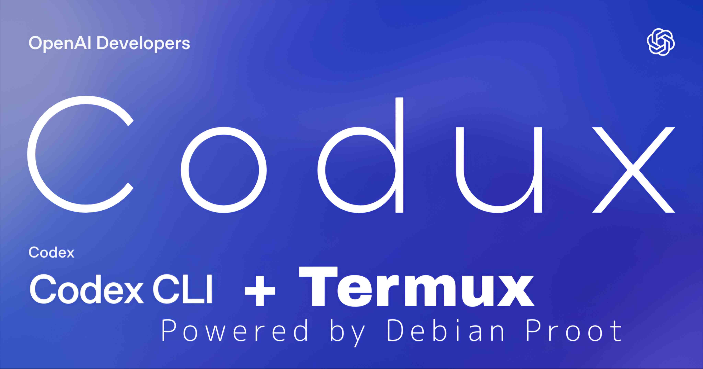
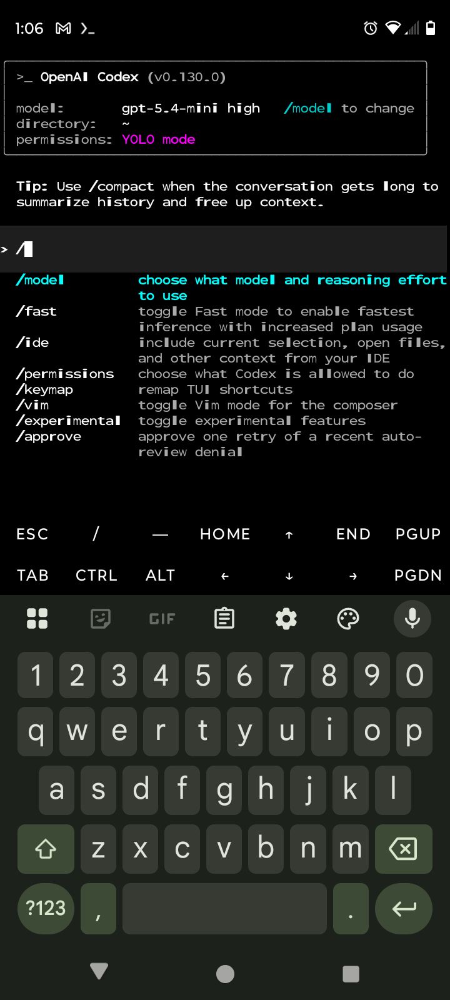
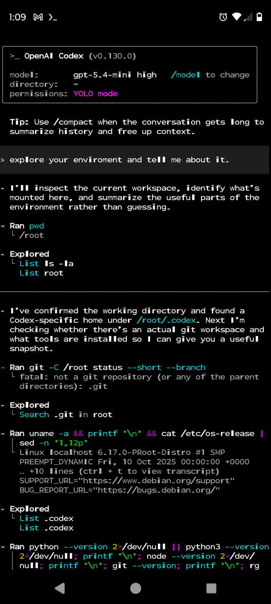
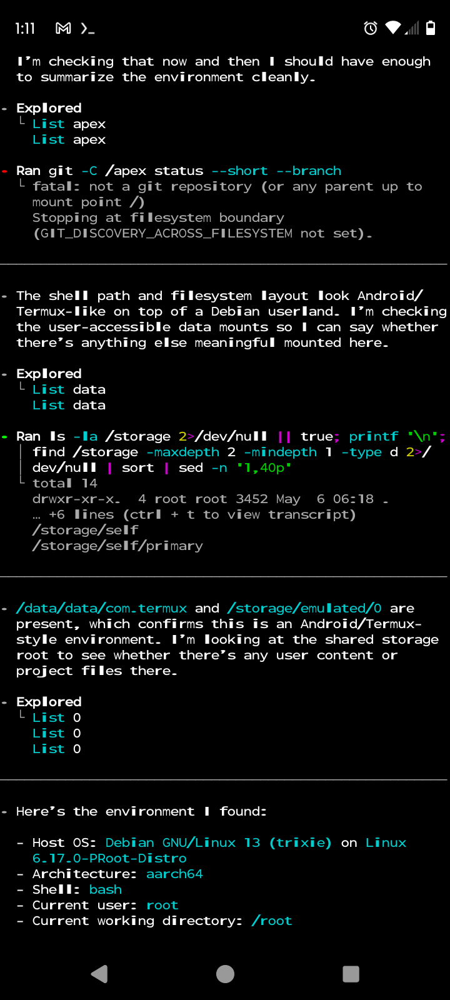
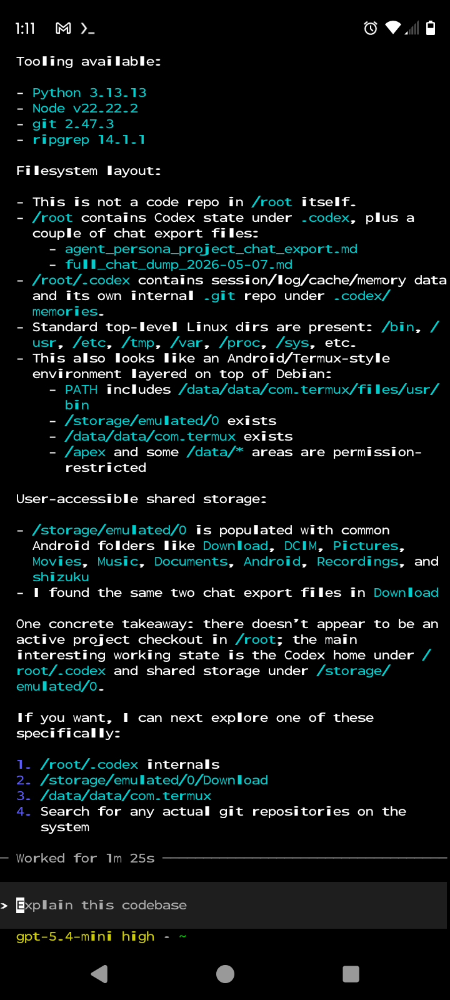
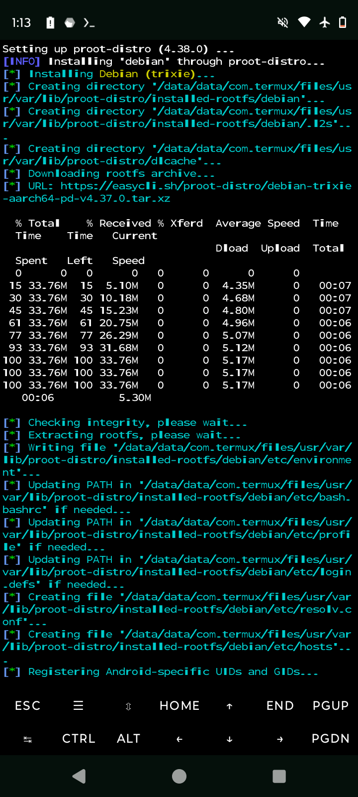
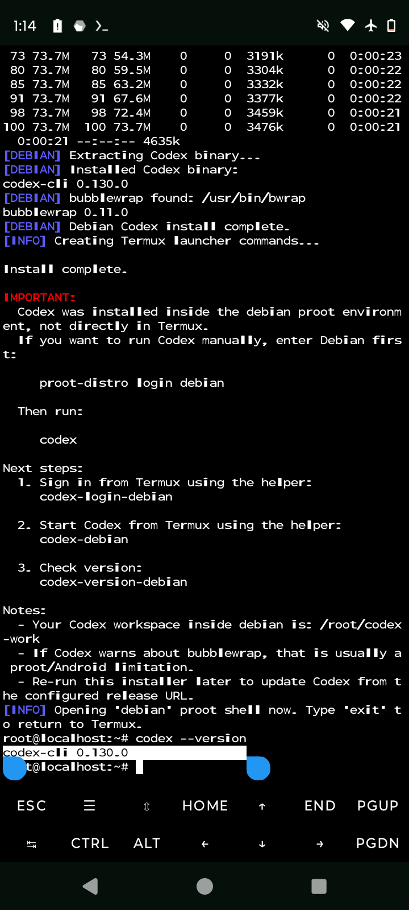

# Codux



<p align="center">
  <strong>OpenAI Codex on Termux for Android ARM64.</strong><br>
  Lightweight Bash installer. Debian proot runtime. Clean, repeatable setup.
</p>

<p align="center">
  <a href="https://github.com/Clock-Skew/Codux/releases/latest"></a>
  <a href="./codux.sh"></a>
  <a href="./codux.sh"></a>
  <a href="https://termux.dev/"></a>
  <a href="https://github.com/termux/proot-distro"></a>
  <a href="./LICENSE"></a>
  <a href="https://github.com/openai/codex"></a>
</p>

Codux is a compact installer for running **OpenAI Codex on Termux** without building a large fork, shipping a custom Rust toolchain, or depending on a long manual setup. It uses `proot-distro` to place Codex inside Debian, which is the core design decision that makes the install path stable on Android ARM64 devices.

## Why Codux

Many "Codex on Termux" approaches are either too heavy or too fragile. Codux is intentionally small:

- one Bash installer
- official Codex Linux ARM64 musl release
- Debian via `proot-distro`
- helper launcher commands created in Termux
- minimal moving parts compared with larger wrapper stacks

The goal is not to replace upstream Codex. The goal is to get **Codex CLI running on Termux** with a setup that is easy to inspect, easy to rerun, and easy to adapt.

## What It Does

Codux:

1. confirms the device is ARM64 and the shell is Termux
2. updates the Termux package layer to avoid partial-upgrade library breakage
3. installs `proot-distro`, `curl`, `ca-certificates`, and `openssl`
4. installs Debian through `proot-distro`
5. downloads the latest Codex Linux ARM64 musl archive
6. installs Codex inside Debian
7. creates helper commands in Termux
8. opens the Debian shell after install so Codex is ready to use

## Why Debian Proot

Codex does not run directly in the normal Termux shell in the same clean way it does inside Debian. Codux uses Debian as the runtime boundary because it gives Codex a more predictable Linux userland while still staying fully inside Android user space.

Runtime model:

```text
Android
  -> Termux
    -> proot-distro
      -> Debian
        -> Codex
```

That means the important thing to remember is simple: **Codex runs inside Debian, not directly in the base Termux shell.**

## Install OpenAI Codex on Termux

```bash
git clone https://github.com/Clock-Skew/Codux.git
cd Codux
chmod +x codux.sh
./codux.sh
```

If you already have the script locally:

```bash
chmod +x codux.sh
./codux.sh
```

The default behavior is opinionated on purpose. Codux upgrades the Termux package stack before installing dependencies because stale or partially upgraded Termux environments are one of the most common causes of broken `curl`, broken TLS libraries, and failed proot setup.

## First Run

After the installer succeeds, Codux opens the Debian shell automatically unless you disable that behavior.

Inside Debian, run:

```bash
codex
```

If you leave Debian and later want to start Codex manually, the core command is:

```bash
proot-distro login debian
```

Then run:

```bash
codex
```

## Termux Helper Commands

Codux creates these helper commands in Termux:

- `codex-debian` launches Codex inside Debian
- `codex-login-debian` starts Codex device authentication inside Debian
- `codex-version-debian` prints the installed Codex version

For most users, these helpers are the cleanest way to start using Codex after the initial install.

## Options

```bash
./codux.sh --help
./codux.sh --version
./codux.sh --no-enter-distro
./codux.sh --no-upgrade
./codux.sh --distro debian
./codux.sh --workdir codex-work
```

Most useful flags:

- `--no-enter-distro` skips the automatic Debian shell entry after install
- `--no-upgrade` skips the Termux upgrade path
- `--workdir` changes the workspace directory inside Debian
- `--distro` changes the `proot-distro` container name
- `--codex-url` overrides the release archive URL

## Screenshots

<p align="center">
  
  
</p>

<p align="center">
  
  
</p>

<p align="center">
  
  
</p>

## Compatibility

Codux is designed for **Android ARM64 + Termux + Debian proot**. It is intentionally narrow in scope. If the device is not ARM64, or if the local Termux environment is badly outdated, expect install failures or runtime instability.

## Troubleshooting

### Termux mirror selection appears during install

Run:

```bash
termux-change-repo
```

Choose a working mirror, then rerun the installer.

### `curl` or `proot-distro` fails after package changes

Run:

```bash
pkg upgrade -y
```

Then rerun Codux. This is the exact class of failure Codux tries to avoid by upgrading Termux packages first.

### Codex does not run after the installer finishes

Make sure you are inside Debian:

```bash
proot-distro login debian
```

Then run:

```bash
codex
```

### I want a smaller or more scriptable flow

Use:

```bash
./codux.sh --no-enter-distro
```

This keeps the installer from dropping directly into Debian after setup.


##Please Note

This script may take some time to complete, depending upon whether it is a fresh install, a pre-existing version, or has bad/outdated mirrors. Please be patient, and do not exit unless an error presents. 

#WARNING

This is barely anything more than a proof of concept, so please go into the endeavor with that mindset. I'm not responsible for breaking or destroying current installs, or for codex wreaking havoc on your device because you chose to use YOLO flags. Good luck travelers. 
